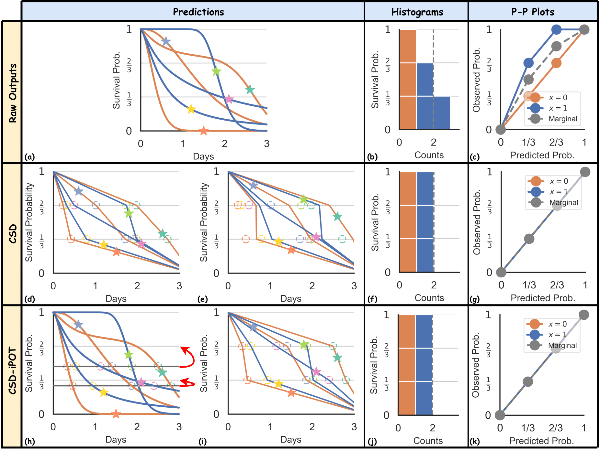

# Make Survival Calibrated Again

---

This official repository contains the code for
1. Conformalized Survival Distributions (**CSD**). See [1].
2. Conformalized Survival Distributions using Individual survival Probability at Observed Time (**CSD-iPOT**). See [2].

It also contains the implementations of the worst-slab distribution calibration score, $\text{Cal}_{\text{ws}}$. See [2]. 

## Introduction

**TL;DR** This repository contains two methods that enhance the calibration of a survival analysis model, without compromising its discriminative ability.

|                                                                                                                                                                                                                                | 
|:------------------------------------------------------------------------------------------------------------------------------------------------------------------------------------------------------------------------------------------------------------:| 
| **Visual illustration of using *CSD* and *CSD-iPOT* to make the prediction calibrated.** (a-c) Raw survival distribution outputs with histogram and P-P plot; (d-g) CSD steps with histogram and P-P plot; (h-k) CSD-iPOT steps with histogram and P-P plot. |

Both **CSD** and **CSD-iPOT** approaches use the same general framework of conformal prediction, but they differ in
how to calculate the conformity score and adjust the positions of the predictions. Note that in the above Figure,
the horizontal positions of the circles remain unchanged for **CSD** while the vertical positions of the
circles remain unchanged for **CSD-iPOT**.
About details of the algorithms (e.g., how to calculate the conformity score, how to handle censorship, etc), please refer to the paper.

## Overview

This repository contains the code for the experiments in the papers. The code is organized as follows:
- `args/`: The arguments for the experiments.
- `CondCalEvaluation/`: The implementation of the conditional calibration score, $\text{Cal}_{\text{ws}}$.
- `data/`: The datasets used in the experiments.
- `figs/`: The figures presented in the papers.
- `icp/`: The implementation of inductive conformal prediction (ICP) for survival analysis. It contains two methods: **CSD** (class name: `ConformalSurvDist`) and **CSD-iPOT** (class name: `CSDiPOT`).
- `models/`: Some self-implemented models (`DeepSurv`/`CoxPH`, `N-MTLR`/`MTLR`, `CQRNN`, `LogNormalNN`) used in the experiments.
- `posters/`: The poster presentations for both methods.
- `utils/`: The utility functions used in the experiments.
- `requirements.txt`: The requirements file to install the necessary packages.
- `README.md`: This file.
- `run.py`: The main script to run `CSD` or `CSD-iPOT`.
- `run_baselines.py`: The script to run the non post-processed baselines.
- `run_sh`: The script to run the experiments in one go.


## Getting Started


### Prerequisites

Clone the repo, create a virtual environment with Python version 3.11.7

```
conda create -n MakeSurvivalCalibratedAgain python=3.11.7
```
Then install the requirements.txt file
```
pip install -r requirements.txt
```


### Running the Experiments

Using the provided codes, reader can run the experiments on a few datasets: `VALCT`, `HFCR`, `PBC`, `WHAS500`,  `GBSG`, `PdM`, `churn`, `NACD`, `FLCHAIN`, `SUPPORT`, `employee`. 

To run the experiments using `CSD` with default parameters, you can use the following script:
```bash
python3 run.py --data [choice_of_data] --model [choice_of_baseline] --post_process CSD
```

To run the experiments using `CSD-iPOT` with default parameters, you can use the following script:
```bash
python3 run.py --data [choice_of_data] --model [choice_of_baseline] --post_process CSD-iPOT
```

To compare the `CSD` or `CSD-iPOT` with the raw baselines, you can use the following script:
```bash
python3 run_baselines.py --data [choice_of_data] --model [choice_of_baseline]
```

For example, to compare `CSD`, and`CSD-iPOT` on the `SUPPORT` dataset using the `AFT` model, you can use the following script:
```bash
python3 run.py --data SUPPORT --model AFT --post_process CSD
python3 run.py --data SUPPORT --model AFT --post_process CSD-iPOT
python3 run_baselines.py --data SUPPORT --model AFT
```

For more details on the argument options, please refer to the `args/__init__.py` file.

## Reference
[1] Shi-ang Qi, Yakun Yu, Russell Greiner. Conformalized Survival Distributions: A Generic Post-Process to Increase Calibration. ICML 2024. [[paper](https://proceedings.mlr.press/v235/qi24a.html)]

[2] Shi-ang Qi, Yakun Yu, Russell Greiner. Toward Conditional Distribution Calibration in Survival Prediction. NeurIPS 2024. [[paper](https://openreview.net/forum?id=l8XnqbQYBK)]

## Citation

We recommend you use the following to cite `CSD` method in your publications:

```
@InProceedings{pmlr-v235-qi24a,
  title = 	 {Conformalized Survival Distributions: A Generic Post-Process to Increase Calibration},
  author =       {Qi, Shi-Ang and Yu, Yakun and Greiner, Russell},
  booktitle = 	 {Proceedings of the 41st International Conference on Machine Learning},
  pages = 	 {41303--41339},
  year = 	 {2024},
  volume = 	 {235},
  series = 	 {Proceedings of Machine Learning Research},
  month = 	 {21--27 Jul},
  publisher =    {PMLR},
  url = 	 {https://proceedings.mlr.press/v235/qi24a.html},
}
```

We recommend you use the following to cite `CSD-iPOT` method in your publications:
```
@inproceedings{qi2024toward,
  title =       {Toward Conditional Distribution Calibration in Survival Prediction},
  author =      {Qi, Shi-Ang and Yu, Yakun and Greiner, Russell},
  booktitle =   {Advances in Neural Information Processing Systems},
  volume =      {37},
  year =        {2024},
  publisher =   {Curran Associates, Inc.},
}
```